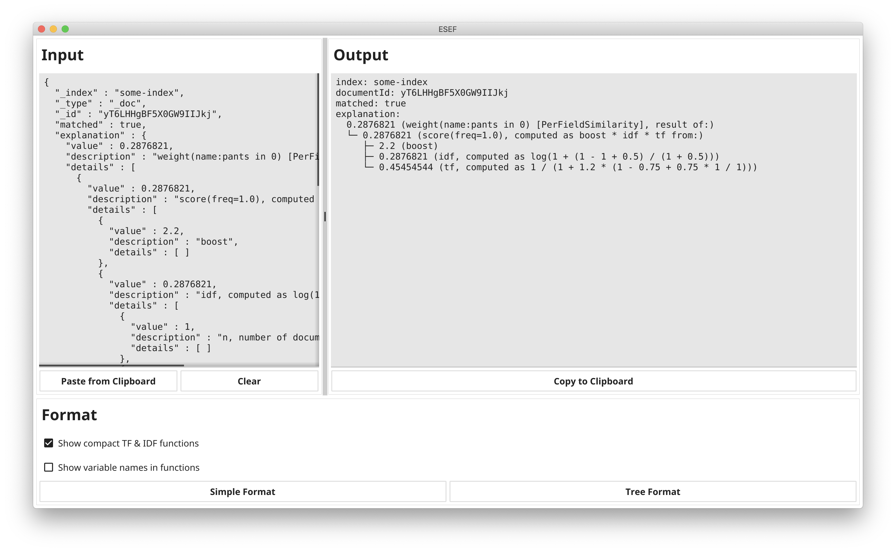

# ESEF
*ElasticSearch Explain (API) Formatter*



ESEF converts the output of ES explain API to a more readable format.

Two types of formats are supported:

- **Simple**
  
  Removes unnecessary brackets and lines, compacts the output and keeps the indentation level

  Example:
  ```
  index: some-index
  documentId: jD1tu3cByfZ6bVksFzLO
  matched: true
  explanation:
  0.287682 (weight(type:car in 0) [PerFieldSimilarity], result of:)
    0.287682 (score(freq=1.0), computed as boost * idf * tf from:)
      2.200000 (boost)
      0.287682 (idf, computed as log(1 + (N - n + 0.5) / (n + 0.5)) from:)
        1.000000 (n, number of documents containing term)
        1.000000 (N, total number of documents with field)
      0.454545 (tf, computed as freq / (freq + k1 * (1 - b + b * dl / avgdl)) from:)
        1.000000 (freq, occurrences of term within document)
        1.200000 (k1, term saturation parameter)
        0.750000 (b, length normalization parameter)
        1.000000 (dl, length of field)
        1.000000 (avgdl, average length of field)
  ```
- **Tree**
  
  Adds a nice tree layout to the format above.

  Example:
  ```
  index: some-index
  documentId: jD1tu3cByfZ6bVksFzLO
  matched: true
  explanation:
    0.287682 (weight(type:car in 0) [PerFieldSimilarity], result of:)
    └─ 0.287682 (score(freq=1.0), computed as boost * idf * tf from:)
       ├─ 2.200000 (boost)
       ├─ 0.287682 (idf, computed as log(1 + (N - n + 0.5) / (n + 0.5)) from:)
       │  ├─ 1.000000 (n, number of documents containing term)
       │  └─ 1.000000 (N, total number of documents with field)
       └─ 0.454545 (tf, computed as freq / (freq + k1 * (1 - b + b * dl / avgdl)) from:)
          ├─ 1.000000 (freq, occurrences of term within document)
          ├─ 1.200000 (k1, term saturation parameter)
          ├─ 0.750000 (b, length normalization parameter)
          ├─ 1.000000 (dl, length of field)
          └─ 1.000000 (avgdl, average length of field)
  ```

## Development

## Run locally
```shell
go run .
```

### Package locally
```shell script
# Build for Mac
rm -r ESEF.app
rm ESEF

cd /dist
fyne package -os darwin -appVersion "0.4.0" -icon ../icon.png -sourceDir ../
```

### Good to know
- If the `fyne` cmd command is missing: `go get fyne.io/fyne/v2/cmd/fyne`
- If the `fyne` cmd command is old:
  1. Try updating it with some kind of `go get update ...` command.
  2. If that does not work try deleting the executable in `GOPATH/bin` and reinstalling it afterwards.
- Go Module support must be enabled in IntelliJ. Also, worth reading [is this article about Go Modules](https://insujang.github.io/2020-04-04/go-modules/).  

## Credits
The app icon is from the [Material Icon Set](https://material.io/resources/icons/?search=tree&icon=account_tree&style=baseline).
